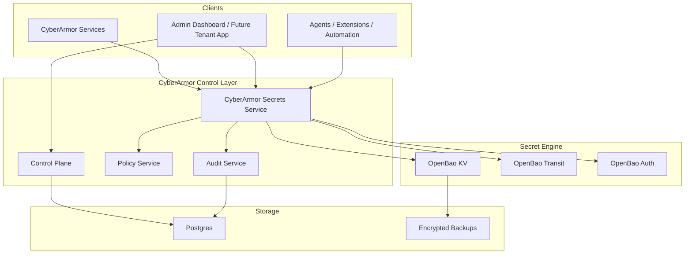

# OpenBao + CyberArmor Secrets Service

This document proposes a concrete architecture for adding a CyberArmor secrets and key service on top of OpenBao, starting on Hetzner and keeping a clean migration path to AWS or another cloud later.

## 1. Bottom Line

Recommended direction:

- use OpenBao as the underlying secret and cryptographic engine
- add a CyberArmor secrets/key service as the policy-aware, tenant-aware control layer
- migrate the highest-value secrets first:
  - PQC private keys
  - AI Router provider credential master keys
  - tenant provider API credentials
  - JWT, HMAC, and signing secrets
- keep the first Hetzner deployment operationally simple:
  - one app VM
  - one OpenBao VM or container-isolated service
  - encrypted backups
  - Docker Compose or small-systemd deployment

This gives us a practical MVP path without locking the product into plain `.env` secrets or forcing us to build a vault from scratch before we have customer traction.

## 2. Goals

The OpenBao + CyberArmor design should solve these problems:

- stop treating high-value keys as application config
- provide tenant-scoped secret storage
- support encryption, decryption, signing, and key rotation without every service managing its own root keys
- centralize audit trails for secret access and key usage
- support future tenant-facing SSO and integration secrets at `app.cyberarmor.ai`
- preserve a path to AWS, Kubernetes, or another cloud later

## 3. Non-Goals For Phase 1

Phase 1 is not intended to deliver:

- a full general-purpose replacement for all Vault/OpenBao features
- dynamic database credentials on day one
- high-availability clustering on the first Hetzner deployment
- a finished customer self-service secret portal

Phase 1 is about secure custody, tenancy boundaries, and product-aligned integration.

## 4. Proposed Architecture

### 4.1 Layered Model

### 4.2 Responsibility Split

OpenBao should own:

- secret storage engine
- versioned KV secrets
- transit encryption and decryption
- signing and key rotation primitives
- auth tokens and policies for the backend secret system

CyberArmor secrets service should own:

- tenant scoping and naming
- product API surface
- authorization based on CyberArmor roles and policies
- secret-class rules
- audit enrichment
- mapping from CyberArmor objects to OpenBao paths and keys
- PQC-aware workflows and future customer UX

## 5. Hetzner MVP Deployment Shape

### Option A: Recommended first production-like deployment

- `VM 1`: CyberArmor app stack
  - Nginx
  - control-plane
  - secrets service
  - policy, detection, response, identity, ai-router, audit
  - Postgres
  - Redis
  - Ollama
- `VM 2`: OpenBao
  - OpenBao server
  - attached encrypted data volume
  - locked-down firewall
  - snapshots plus encrypted backup export

Why this is recommended:

- secret engine is not co-located with the app process
- compromise of the app host is less likely to immediately expose the secret backend storage
- easier future migration to managed/cloud environments

### Option B: Lowest-cost initial start

- one Hetzner VM
- OpenBao runs in a dedicated container or systemd service
- storage on a separate attached volume
- strict host firewall and local-only binding for OpenBao

This is acceptable for internal testing and early MVP, but should be treated as transitional.

## 6. OpenBao Layout

Recommended logical layout:

- mount `kv-v2` at `cyberarmor-kv/`
- mount `transit` at `cyberarmor-transit/`
- mount auth method for app/service identities

Suggested path conventions:

- `cyberarmor-kv/platform/shared/<secret-name>`
- `cyberarmor-kv/platform/service/<service-name>/<secret-name>`
- `cyberarmor-kv/tenants/<tenant-id>/integrations/<provider>`
- `cyberarmor-kv/tenants/<tenant-id>/identity/<secret-name>`
- `cyberarmor-kv/tenants/<tenant-id>/agents/<agent-id>`

Suggested transit key naming:

- `cyberarmor-transit/keys/router-master`
- `cyberarmor-transit/keys/audit-signing`
- `cyberarmor-transit/keys/tenant-<tenant-id>-provider-creds`
- `cyberarmor-transit/keys/service-<service-name>-jwt`

## 7. CyberArmor Secrets Service

### 7.1 New Service To Add

Add a new service:

- `services/secrets-service`

Primary responsibilities:

- provide a stable CyberArmor API for secret operations
- hide OpenBao path and token details from the rest of the platform
- enforce tenant and role checks
- record audit logs for all read, write, rotate, encrypt, decrypt, sign, and revoke operations
- support future customer-facing secret workflows

### 7.2 Initial API Surface

Recommended first endpoints:

- `POST /v1/secrets/tenant/{tenant_id}/provider-credentials/{provider}`
- `GET /v1/secrets/tenant/{tenant_id}/provider-credentials/{provider}/metadata`
- `POST /v1/secrets/tenant/{tenant_id}/provider-credentials/{provider}/rotate`
- `POST /v1/crypto/encrypt`
- `POST /v1/crypto/decrypt`
- `POST /v1/crypto/sign`
- `GET /v1/keys/public/{service_name}`
- `POST /v1/keys/rotate/{service_name}`

Important rule:

- other services should ask the secrets service to perform sensitive operations instead of each service talking directly to OpenBao in phase 1

That keeps the product logic in one place.

## 8. What Components We’d Add

### New runtime components

- `OpenBao` server
- `CyberArmor secrets service`
- `OpenBao bootstrap/init job`
- `OpenBao policy templates for services and tenants`
- `backup/export job for OpenBao snapshots or storage backups`

### New code components

- OpenBao client wrapper in `libs/cyberarmor-core`
- secrets service API models and auth middleware
- tenant-aware secret path resolver
- secret classification and authorization rules
- audit event schema for secret operations
- migration scripts to move env-based secrets into OpenBao

### New operational components

- unseal/init runbook
- disaster recovery runbook
- key rotation runbook
- secret break-glass runbook
- backup verification checklist

## 9. What Current CyberArmor Code We Should Refactor First

### Priority 1: PQC key storage

Current issue:

- PQC private keys are persisted to local filesystem JSON in the shared crypto layer

Refactor target:

- replace direct filesystem persistence with secrets-service backed storage
- keep public-key exposure in service code
- move private-key retrieval to secrets service or wrapped OpenBao access

Code area:

- [key_rotation.py](/Users/patrickkelly/Documents/CyberArmorAi/libs/cyberarmor-core/cyberarmor_core/crypto/key_rotation.py)

### Priority 2: AI Router master key and provider credentials

Current issue:

- provider API keys are encrypted in the DB, but the root encryption key is just an env var

Refactor target:

- stop using `ROUTER_ENCRYPTION_KEY` as a long-lived env root key
- use OpenBao transit for encryption/decryption or use a wrapped data-key model via the secrets service
- move tenant provider credential storage under tenant-scoped secret paths

Code area:

- [main.py](/Users/patrickkelly/Documents/CyberArmorAi/services/ai-router/main.py)

### Priority 3: JWT, HMAC, and signing secrets

Current issue:

- JWT and service auth secrets are still mostly env-managed

Refactor target:

- centralize retrieval through secrets service
- rotate versioned signing keys
- distinguish platform-global versus tenant-scoped secrets

Code areas:

- [main.py](/Users/patrickkelly/Documents/CyberArmorAi/services/control-plane/main.py)
- [main.py](/Users/patrickkelly/Documents/CyberArmorAi/services/agent-identity/main.py)
- [main.py](/Users/patrickkelly/Documents/CyberArmorAi/services/audit/main.py)

### Priority 4: Deployment and configuration model

Current issue:

- `.env` is still the dominant shape for secrets in Docker Compose and some deployment docs

Refactor target:

- env vars become references or bootstrap settings only
- app secrets are pulled at startup from the secrets service or OpenBao
- strict production startup checks reject inline placeholder values

Code and docs:

- [infra/docker-compose/.env.example](/Users/patrickkelly/Documents/CyberArmorAi/infra/docker-compose/.env.example)
- [docs/deployment/hetzner-ubuntu-vm.md](/Users/patrickkelly/Documents/CyberArmorAi/docs/deployment/hetzner-ubuntu-vm.md)

## 10. Data Flow Examples

### 10.1 AI Router provider credential write

1. Tenant admin configures provider in the future tenant app or current admin flow.
2. Control plane calls secrets service with tenant context and provider metadata.
3. Secrets service stores metadata in Postgres if needed and the secret value in OpenBao KV or encrypts it via Transit.
4. Audit service records who performed the action and for which tenant.
5. AI Router later requests use of the credential through secrets service.

### 10.2 PQC private key lookup

1. Service receives a `PQC:` wrapped credential.
2. Service extracts `key_id`.
3. Service retrieves the active or previous private key from secrets service.
4. Secrets service fetches or decrypts the key material from OpenBao-backed storage.
5. Access is audited with service identity, purpose, tenant context if applicable, and key version.

## 11. Security Model

### Service authentication

Recommended phase 1:

- services authenticate to secrets service using the shared PQC auth path already built in CyberArmor
- secrets service authenticates to OpenBao using a tightly scoped service token or AppRole-style identity

### Authorization

Rules should be enforced in CyberArmor first:

- global platform roles can manage platform-global secrets
- tenant admins can manage only their own tenant secrets
- service identities can read only the exact secret classes they require
- raw secret read should be rarer than indirect operation

### Audit

Every secrets service operation should emit:

- actor
- service or human identity
- tenant id
- secret class
- operation type
- result
- key version where relevant
- trace id or request id

## 12. Migration Strategy

### Phase 0: Design and bootstrap

- deploy OpenBao on Hetzner
- create base mounts and policies
- add secrets service skeleton
- add OpenBao client wrapper

### Phase 1: Migrate highest-value keys

- PQC private keys
- AI Router root encryption path
- audit signing key
- control-plane and agent-identity JWT material

### Phase 2: Tenant integration secrets

- provider credentials
- IdP client secrets
- webhook signing secrets
- future tenant API credentials

### Phase 3: Customer-facing UX

- tenant secret inventory view
- rotation workflows
- connection-test flows
- SSO secret storage and validation

## 13. MVP Build Plan

Recommended first implementation sequence:

1. Add `services/secrets-service`.
2. Add a shared OpenBao client module in `libs/cyberarmor-core`.
3. Implement `transit encrypt/decrypt/sign` wrappers.
4. Refactor `ai-router` to stop using env-root symmetric encryption.
5. Refactor PQC key rotation storage away from local JSON.
6. Move JWT/signing material retrieval to secrets service.
7. Update Hetzner deployment docs to include OpenBao bootstrap and backup steps.

## 14. What Not To Do

- do not expose OpenBao directly to browser extensions, agents, or tenant users
- do not make every service its own secret-management client on day one
- do not keep local-disk PQC private keys once the secrets service exists
- do not build a brand-new vault storage engine before we validate the CyberArmor layer

## 15. Recommendation

The best path is:

- adopt OpenBao now
- build the CyberArmor secrets/key service immediately above it
- refactor the current highest-risk secret paths first
- keep the user-facing value in CyberArmor, not in a homegrown reinvention of Vault internals

This gives us a secure, low-cost, self-hosted path on Hetzner while also moving toward a differentiated long-term CyberArmor platform.
