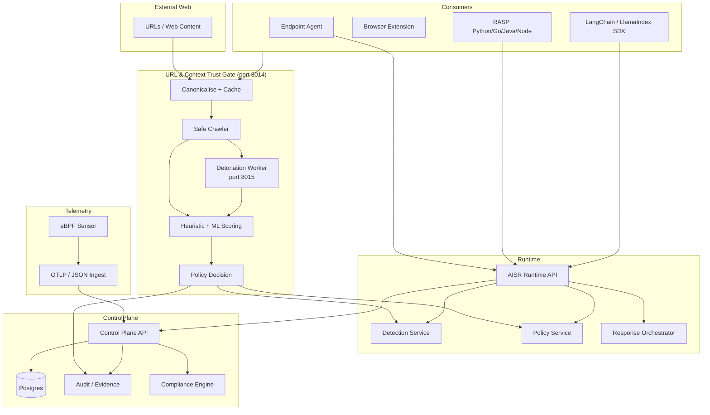

# CyberArmor / CyberArmor Platform Architecture

## The platform in one view (Mermaid)

## Product narrative (investor + buyer)
CyberArmor is an **AI Security Runtime** that enforces policy at the point where AI is actually used:
- before AI ingests external content (URL / Context Trust Gate)
- on the endpoint and inside the application
- on the network path
- and at the kernel (telemetry)

Unlike single-layer “prompt filters,” CyberArmor provides a **closed-loop runtime**:
1) gate external content before ingestion, 2) observe, 3) decide, 4) act, 5) prove.

## Key proof points
- **Pre-ingestion gate**: URL Trust Gate with ML-based detection, three reputation feeds, and Playwright detonation — running end-to-end, 15-minute PoC installer available
- **Linux**: eBPF sensor for process + network telemetry
- **macOS**: Endpoint Security framework sensor (pilot)
- **Windows**: kernel sensor (pilot)

## What to demo in 60 seconds
1. Run `scripts/poc/install.sh` — stack up in under 2 minutes
2. `python run_url_trust_gate_demo.py` submits four crafted attack pages
3. Each returns a live verdict (allow / warn / block) in under 120 ms
4. Audit service records the evidence chain with scores and IOCs
5. Policy service shows the tenant block-list rule that triggered the block
